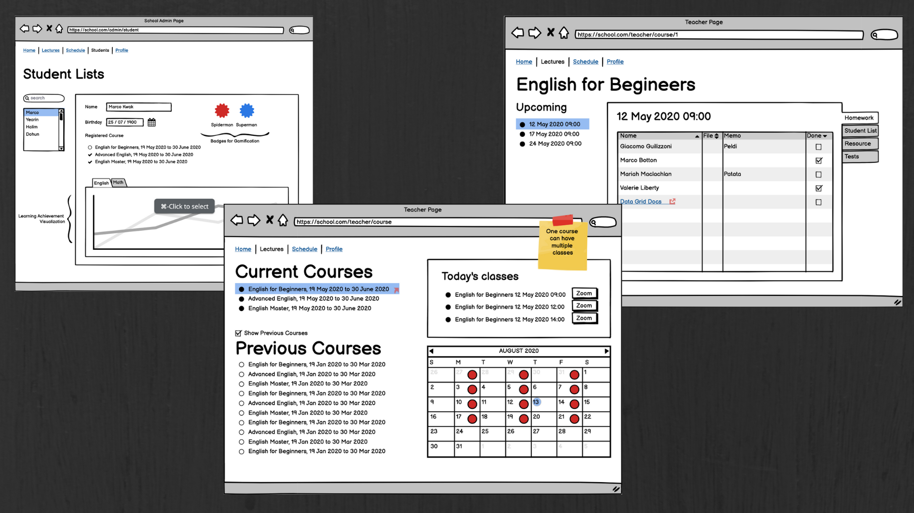

## Classo(in-progress)

Scheduling application for private schools with multiple courses and teachers.  
{:.lead}

1. this list will be replaced by the toc
{:toc .large-only}


{:.lead width="1920" height="1080" loading="lazy"}

Classo's wireframe 
{:.figcaption}

**Classo** is built with TypeScript using redux and saga framework. Classo API is built in a docker container as an image. Uses Express.js and tested with Jest framework 

<!--Relevant links - [Classo-Application]{:.heading.flip-title}, [Classo-Github]{:.heading.flip-title}
{:.lead}-->

## Annibot

Telegram Chatbot to remind users one week before anniversary 
{:.lead}

{:.lead width="1920" height="1080" loading="lazy"}
Add Anniversary to get reminded
{:.figcaption}

{:.lead width="1920" height="1080" loading="lazy"}
Edit and delete anniversary with /edit and /delete command
{:.figcaption}

Relevant links - [Annibot-Telegram]{:.heading.flip-title}, [Annibot-Github]{:.heading.flip-title}
{:.lead}

**Annibot** is built with JavaScript and Node.js. Built with Telegraf library, Annibot is hosted on AWS EC2 and its postgreSQL server is on AWS RDS. 

## Merlabot

Facebook Chatbot for Korean travellers and residents in Singapore
{:.lead}

{:.lead width="1920" height="1080" loading="lazy"}
Give most recent information and news from Singapore
{:.figcaption}

Relevant links - [Merlabot-Github]{:.heading.flip-title}
{:.lead}

**Merlabot** is built with JavaScript and Node.JS. Worked with a team of developers for a project with grant received from NUS Innovation And Entrepreneurship Practicum Award.

[blog]: /
[portfolio]: https://hydejack.com/examples/
[resume]: https://hydejack.com/resume/
[download]: https://hydejack.com/download/
[welcome]: https://hydejack.com/
[forms]: https://hydejack.com/forms-by-example/
[Classo-Application]: https://classo.com
[Classo-Github]: github.com/classo
[Annibot-Telegram]: https://t.me/Annivbot
[Annibot-Github]: https://github.com/geeemchee/annibot2
[Merlabot-Github]: https://github.com/doinghun/merlabot-public

[features]: #features
[news]: #build-an-audience
[syntax]: syntax-highlighting
[latex]: #beautiful-math
[dark]: https://hydejack.com/blog/hydejack/2018-09-01-introducing-dark-mode/
[search]: https://hydejack.com/#_search-input
[grid]: https://hydejack.com/blog/hydejack/

[lic]: LICENSE.md
[pro]: licenses/PRO.md
[docs]: docs/README.md
[ofln]: docs/advanced.md#enabling-offline-support
[math]: docs/writing.md#adding-math

[kit]: https://github.com/hydecorp/hydejack-starter-kit/archive/v9.0.3.zip
[src]: https://github.com/hydecorp/hydejack
[gem]: https://rubygems.org/gems/jekyll-theme-hydejack
[buy]: https://gum.co/nuOluY
[nfy]: https://app.netlify.com/start/deploy?repository=https://github.com/hydecorp/hydejack-starter-kit
[dtn]: https://www.netlify.com/img/deploy/button.svg

[gpss]: https://developers.google.com/speed/pagespeed/insights/?url=https%3A%2F%2Fhydejack.com%2Fdocs%2F
[rouge]: http://rouge.jneen.net
[katex]: https://khan.github.io/KaTeX/
[mathjax]: https://www.mathjax.org/
[tinyletter]: https://tinyletter.com/
